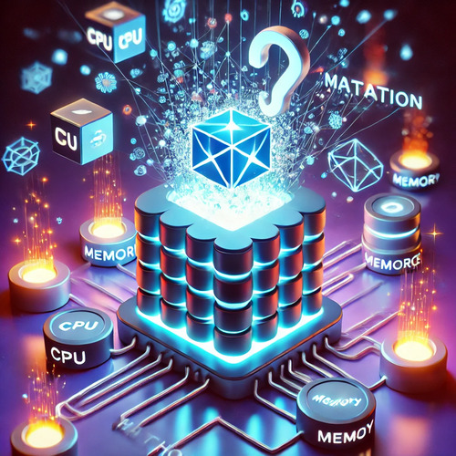

# 🚀 **Pod Webhook Mutator**

> This project implements a Kubernetes Mutating Admission Webhook for pod resources. The webhook mutates the pod objects by modifying the environment variables of containers in the pod.



## 📚 **Table of Contents**

- [Project Structure](#project-structure)
- [Getting Started](#getting-started)
  - [Prerequisites](#prerequisites)
  - [Kind Cluster Setup](#kind-cluster-setup)
  - [Certificate Generation](#certificate-generation)
  - [Docker Build and Push](#docker-build-and-push)
  - [Deploying to Kind](#deploying-the-webhook)
  - [Testing](#testing-the-webhook)
- [Usage](#usage)
- [Contributing](#contributing)
- [Code of Conduct](#code-of-conduct)
- [License](#license)
- [Please Star the Repo](#please-star-the-repo)

## 🏗️ **Project Structure**

- **`Dockerfile`, `Makefile`, `README.md`**: Project build, configuration, and documentation files. 🛠️
- **`certs`**: SSL/TLS certificate-related files for secure communication 🔒.
- **`client`**: Client-side HTTP requests for testing or interacting with the webhook 💻.
- **`cmd`**: The main application entry point (e.g., starting the server) 🚀.
- **`docs`**: Documentation for certificates and Docker usage 📖.
- **`manifests`**: Kubernetes resources for deploying and managing the webhook in a Kubernetes cluster ☸️.
- **`pkg`**: Core application logic, including configuration, webhook handlers, and mutation logic 🔧.

## 🏁 **Getting Started**

### 📋 **Prerequisites**

Before you start, make sure you have the following tools installed:

- Kind 🛠️
- Docker 🐳
- kubectl 🛑
- kustomize 🧩
- Go (for development) 🖥️

### 🌍 **Kind Cluster Setup**

1. **Kind cluster configuration**:

```yaml
kind: Cluster
apiVersion: kind.x-k8s.io/v1alpha4
nodes:
- role: control-plane
  image: kindest/node:v1.32.2
- role: worker
  image: kindest/node:v1.32.2
- role: worker
  image: kindest/node:v1.32.2
```

2. **Apply the cluster configuration**:

```bash
kind create cluster --config kind.yaml
```

### 🛡️ **Certificate Generation**

Follow the [instructions](docs/certs.md) to generate the necessary certificates for the webhook.

### 🏗️ **Docker Build and Push**

Follow the [instructions](docs/docker.md) to build and push the Docker image to a container registry.

### 🚀 **Deploying the Webhook**

```bash
make deploy
```

### 🧪 **Testing the Webhook**

Test the webhook with the following command:

```bash
kubectl apply -f manifests/examples/pod.yaml
```

### 🧹 **Cleanup**

To clean up:

```bash
make undeploy
kind delete cluster
```

## 🛠️ **Usage**

The webhook mutates pods to add a specific label and annotation based on the configuration.

## 🙋‍♂️ **Contributing**

Pull requests are welcome! For major changes, please open an issue first to discuss what you'd like to change.

## 🧑‍🤝‍🧑 **Code of Conduct**

This project and everyone participating in it is governed by the [Contributor Covenant Code of Conduct](https://www.contributor-covenant.org/). By participating, you are expected to uphold this code. Please report unacceptable behavior to the project team.

The goal of this code of conduct is to ensure a welcoming, respectful, and productive environment for all contributors. The expectations are:

- **Be respectful**: Treat everyone with kindness and empathy.
- **Be inclusive**: Embrace diversity of thought, background, and perspective.
- **Be responsible**: Take ownership of your contributions and interactions.
- **Be collaborative**: Foster a cooperative environment where knowledge sharing is encouraged.

For more details, please refer to the full [Code of Conduct](https://www.contributor-covenant.org/version/2/0/code_of_conduct.html).

## 📄 **License**

This project is licensed under the Apache License 2.0 - see the [LICENSE](LICENSE) file for details.

## ⭐ **Please Star the Repo**

If you find this project useful, please consider giving it a ⭐️ on GitHub. Your star helps us reach more developers and contributors and supports the continued improvement of the project. It’s a great way to show appreciation! 😊